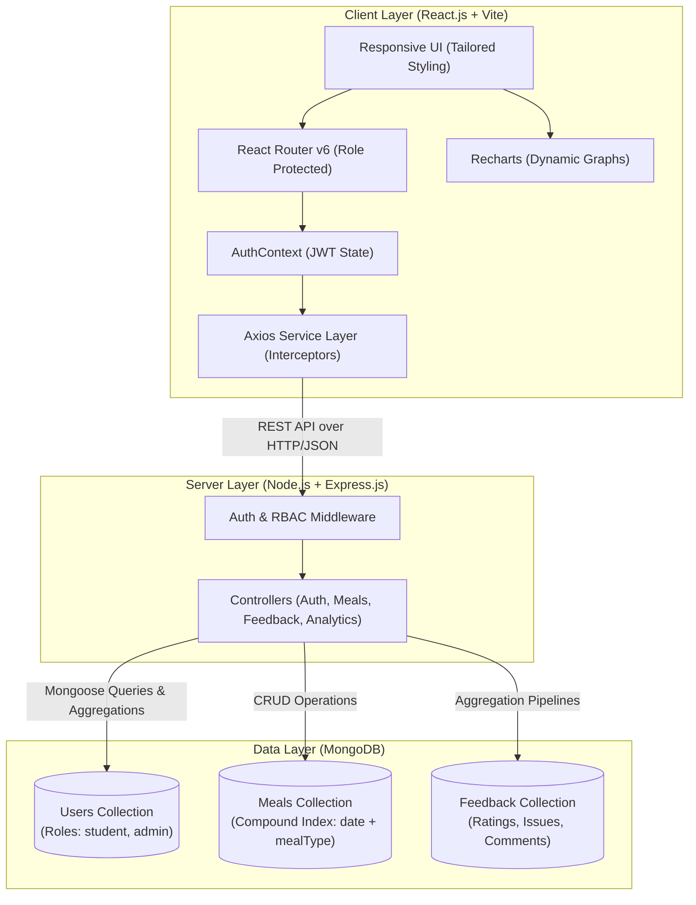

# 🍽️ MessMate – College Hostel Mess Feedback & Management System

> A modern, responsive, full-stack college hostel dining management and student feedback platform built with **React.js**, **Node.js**, **Express.js**, **MongoDB**, and **Recharts**.

---

## 📌 1. Project Overview & Problem Statement

### The Problem
In collegiate residential systems, hostel dining halls serve thousands of meals daily. However, communication between students and catering supervisors is traditionally broken, relying on sporadic paper complaint registers, informal WhatsApp messages, or heated student council disputes. Kitchen administrations lack granular, quantifiable insights to pinpoint recurring culinary failures (e.g. food served cold, excessive salt or oil, delayed meal counters).

### The Solution
**MessMate** provides an institutional, transparent, role-based feedback platform. Students track daily and weekly menus, rate meals using a **4-pillar evaluation model** (Taste, Food Quality, Hygiene, and Quantity), flag specific issues in real-time, and track their personal review history. Simultaneously, mess administrators leverage an analytics dashboard powered by dynamic **MongoDB aggregation pipelines** and **Recharts** data visualizations to track satisfaction trends, monitor complaints, and update mess schedules.

---

## 🚀 2. Key Features

### 🧑‍🎓 Student Experience
- **Secure Authentication**: Register and login with JWT and bcrypt password encryption. Profile captures hostel block and room number.
- **Dynamic Student Dashboard**: Personalized greeting (`Good Morning/Afternoon, Student 👋`), today's meal schedule with live student ratings, personal feedback counts, and average personal rating.
- **Interactive Daily & Weekly Menus**: View Breakfast, Lunch, Snacks, and Dinner with item chips and chef notes.
- **4-Dimensional Rating System**: Rate every meal independently across:
  - 👅 **Taste & Flavor** (1–5 Stars)
  - 🥗 **Food Quality** (1–5 Stars)
  - 🧼 **Kitchen & Plate Hygiene** (1–5 Stars)
  - 🍚 **Portion Quantity** (1–5 Stars)
- **Granular Issue Flagging**: One-click tags for specific kitchen defects:
  - `Too spicy`, `Too salty`, `Too oily`, `Food was cold`, `Poor quality`, `Less quantity`, `Poor variety`, `Other`
- **Feedback History & Self-Service CRUD**: Search, filter by date/meal/rating, and edit or delete previous feedback entries.
- **Resident Profile**: View account credentials, room assignment, and overall participation statistics.

### 🛡️ Admin & Mess Authority Console
- **Executive Metric KPI Cards**: Real-time counters for **Total Students**, **Total Feedback**, **Average Rating**, and **Issues Reported**.
- **Visual Analytics with Recharts**:
  - 📊 **Graph 1: Average Rating by Meal (Bar Chart)** – Dynamic comparison across Breakfast, Lunch, Snacks, and Dinner.
  - 📈 **Graph 2: Mess Rating Trend (Line Chart)** – 7-day and 30-day chronological average satisfaction trend.
  - 📉 **Graph 3: Most Reported Food Issues (Horizontal Bar Chart)** – Real-time frequency of complaints derived from MongoDB aggregations.
- **Centralized Feedback Management**:
  - Full-text search across student names, emails, and comments.
  - Multi-faceted filters for Date, Meal Type, Star Rating, and Complaint category.
  - Administrative deletion and moderation.
- **Menu Management (CMS)**:
  - Create, update, or remove meals for any date.
  - Comma-delimited dish item parsing.
- **Student Directory**: Inspect student engagement metrics, room numbers, and individual feedback contributions.

---

## 🛠️ 3. Tech Stack

| Layer | Technologies |
|---|---|
| **Frontend** | React.js (JavaScript, Vite), React Router v6, Axios, Recharts, Lucide React, HTML5, Modern CSS3 |
| **Backend** | Node.js, Express.js, RESTful API architecture |
| **Database** | MongoDB, Mongoose ODM (Aggregation Pipelines, Compound Indexes) |
| **Security & Auth** | JSON Web Tokens (JWT), bcryptjs password hashing, Role-Based Access Control (RBAC) |
| **Environment** | dotenv, CORS |

---

## 📐 4. System Architecture



---

## 🗄️ 5. Database Schema & Models

### 1. User Model (`models/User.js`)
```javascript
{
  name: { type: String, required: true },
  email: { type: String, required: true, unique: true, lowercase: true },
  password: { type: String, required: true, select: false },
  role: { type: String, enum: ['student', 'admin'], default: 'student' },
  hostel: { type: String, required: true },
  roomNumber: { type: String, required: true },
  createdAt: { type: Date, default: Date.now }
}
```

### 2. Meal Model (`models/Meal.js`)
```javascript
{
  date: { type: String, required: true }, // Format: YYYY-MM-DD
  mealType: { type: String, enum: ['Breakfast', 'Lunch', 'Snacks', 'Dinner'], required: true },
  items: [{ type: String, required: true }],
  description: { type: String, default: '' },
  createdAt: { type: Date, default: Date.now }
}
// Unique compound index: { date: 1, mealType: 1 }
```

### 3. Feedback Model (`models/Feedback.js`)
```javascript
{
  studentId: { type: ObjectId, ref: 'User', required: true },
  mealId: { type: ObjectId, ref: 'Meal', default: null },
  mealType: { type: String, enum: ['Breakfast', 'Lunch', 'Snacks', 'Dinner'], required: true },
  date: { type: String, required: true },
  tasteRating: { type: Number, min: 1, max: 5, required: true },
  qualityRating: { type: Number, min: 1, max: 5, required: true },
  hygieneRating: { type: Number, min: 1, max: 5, required: true },
  quantityRating: { type: Number, min: 1, max: 5, required: true },
  averageRating: { type: Number, min: 1, max: 5 }, // Pre-save calculated average
  issues: [{ type: String }],
  comment: { type: String, maxlength: 500 },
  createdAt: { type: Date, default: Date.now }
}
```

---

## ⚡ 6. REST API Endpoints

### Authentication Routes (`/api/auth`)
| Method | Endpoint | Access | Description |
|---|---|---|---|
| `POST` | `/api/auth/register` | Public | Register new student account |
| `POST` | `/api/auth/login` | Public | Authenticate user & issue JWT |
| `GET` | `/api/auth/me` | Authenticated | Retrieve current user profile |

### Meal & Menu Routes (`/api/meals`)
| Method | Endpoint | Access | Description |
|---|---|---|---|
| `GET` | `/api/meals/today` | Public / Auth | Fetch today's meals with average rating |
| `GET` | `/api/meals/weekly` | Public / Auth | Fetch weekly menu grouped by day |
| `GET` | `/api/meals` | Authenticated | Filter meals by date / meal type |
| `POST` | `/api/meals` | Admin Only | Create new meal offering |
| `PUT` | `/api/meals/:id` | Admin Only | Update existing meal |
| `DELETE` | `/api/meals/:id` | Admin Only | Delete meal offering |

### Feedback Routes (`/api/feedback`)
| Method | Endpoint | Access | Description |
|---|---|---|---|
| `POST` | `/api/feedback` | Student Only | Submit new 4-pillar review & issue tags |
| `GET` | `/api/feedback/my-history` | Student Only | Get student's review history & summary |
| `GET` | `/api/feedback` | Admin Only | Admin search, filter, and pagination |
| `GET` | `/api/feedback/:id` | Private | Get single feedback details |
| `PUT` | `/api/feedback/:id` | Student/Admin | Update feedback |
| `DELETE` | `/api/feedback/:id` | Student/Admin | Delete feedback |

### Analytics Routes (`/api/admin/analytics`)
| Method | Endpoint | Access | Description |
|---|---|---|---|
| `GET` | `/api/admin/analytics/overview` | Admin Only | Total students, feedback count, avg rating, total issues |
| `GET` | `/api/admin/analytics/meal-ratings`| Admin Only | MongoDB aggregation of ratings per meal type |
| `GET` | `/api/admin/analytics/rating-trend`| Admin Only | Daily average satisfaction line trend (7/30 days) |
| `GET` | `/api/admin/analytics/issues` | Admin Only | Frequency distribution of reported issues |

### Student Directory Routes (`/api/admin/students`)
| Method | Endpoint | Access | Description |
|---|---|---|---|
| `GET` | `/api/admin/students` | Admin Only | List students with feedback count & avg score |

---

## 🔑 7. Demo Credentials

The database comes pre-seeded with realistic data across students, admin, meals, and reviews:

| Role | Name | Email | Password |
|---|---|---|---|
| **Admin** | Mess Supervisor Rao | `admin@messmate.edu` | `Admin@123` |
| **Student** | Rahul Sharma | `rahul@messmate.edu` | `Student@123` |
| **Student** | Priya Patel | `priya@messmate.edu` | `Student@123` |

*(Quick 1-Click demo autofill buttons are built right into the Login interface for testing. `@hostelbites.edu` aliases are also supported).*

---

## 💻 8. Installation & Setup Instructions

### Prerequisites
- **Node.js** (v18+ recommended)
- **MongoDB** (running locally or MongoDB Atlas connection string)
- **npm** or **yarn**

### 1. Clone & Enter Directory
```bash
git clone <repo-url>
cd MessMate
```

### 2. Configure Environment Variables
Inside `server/.env`:
```env
PORT=5050
MONGO_URI=mongodb://127.0.0.1:27017/hostelbites
JWT_SECRET=hostelbites_super_secret_jwt_key_2026_secure
NODE_ENV=development
```

### 3. Install Dependencies
```bash
# From the root directory:
npm run install:all
```
*(Or manually run `npm install` inside both `server/` and `client/` directories.)*

### 4. Seed the Database
Populate realistic admin, students, daily meals, and 90+ feedback entries:
```bash
npm run seed
```

### 5. Start the Application
Run the backend and frontend in separate terminals:

**Terminal 1 (Backend Server):**
```bash
npm run server
# Express API runs on http://localhost:5050
```

**Terminal 2 (Frontend Client):**
```bash
npm run client
# Vite React app runs on http://localhost:5173
```

Visit **`http://localhost:5173`** in your browser!

---

## 🔮 9. Future Enhancements
- Push notifications / WhatsApp alerts when weekly mess menu changes.
- QR code stickers on mess dining tables for instant instant-table scanning.
- Mess inventory management and raw ingredient stock tracking.
- Student dietary preference tags (Jain, Vegan, Gluten-free, Halal).

---

## 📄 License
ISC License &copy; MessMate Team.
